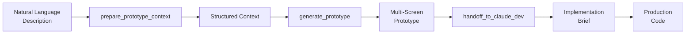
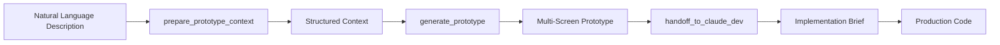

# v0-mcp

[English](README.md) | [中文](README_zh.md)

Vercel v0 MCP Server for Claude Code - Generate beautiful UI components using AI through the Model Context Protocol.

> ✨ **Collaborative Development**: This project was built through innovative collaboration between Claude Code and Gemini CLI using Vibe Coding methodology - demonstrating the power of AI-assisted development workflows.

## 🎯 Features

### 7 Powerful Tools

**Core V0 Tools (4 tools):**
- 🎨 **Generate UI Components**: Create React components from natural language descriptions
- 🖼️ **Image to UI**: Convert design images and wireframes into working React code
- 💬 **Chat-based Iteration**: Iteratively refine components through conversation
- ✅ **Setup Verification**: Validate API connectivity and configuration

**Prototype Workflow Tools (3 tools):**
- 📝 **Context Preparation**: Parse natural language product descriptions into structured requirements
- 🚀 **Multi-Screen Generation**: Generate complete multi-screen UI prototypes in one call
- 📋 **Implementation Handoff**: Create structured briefs for developers with UX patterns and rules

### Technical Features

- **TypeScript Support**: Full type safety with Zod schema validation
- **Streaming Support**: Real-time generation progress for multi-screen prototypes
- **Multiple Models**: Support for v0-1.5-md, v0-1.5-lg, and v0-1.0-md
- **Error Handling**: Comprehensive error handling with retry logic and rate limit detection
- **Structured Logging**: Winston-based logging with detailed metadata
- **Testing Infrastructure**: Jest-based testing with comprehensive coverage
- **MCP Protocol**: Native integration with Claude Code, Claude Desktop, and Cursor IDE

---

## 🧩 How It Works

v0-mcp provides **two complementary approaches** for UI development:

### Approach 1: Core Tools (Component-Level)

Perfect for building **individual components** or when you have specific UI needs.

```
You → v0_generate_ui → Generated Component
     → v0_generate_from_image → Generated Component
     → v0_chat_complete → Refined Component
```

**Use when:**
- Building standalone components (forms, cards, modals)
- Converting single designs to code
- Iterating on a specific UI element
- Rapid prototyping of small features

---

### Approach 2: Workflow Tools (Application-Level)

Perfect for building **complete multi-screen applications** with structured handoff.

```
Natural Language Description
          ↓
    [prepare_prototype_context]
          ↓
    Structured Context (product name, screens, platform)
          ↓
    [generate_prototype]
          ↓
    Multi-Screen Prototype (6 screens, 24 components, preview URL)
          ↓
    [handoff_to_claude_dev]
          ↓
    Implementation Brief (UX patterns, dev rules, screen flows)
          ↓
    Production Code (Claude Dev implements backend)
```

**Use when:**
- Building complete applications (dashboards, SaaS, e-commerce)
- Need multiple related screens
- Want structured UI → Dev handoff
- Separating design from implementation

---

### Key Differences

| Aspect | Core Tools | Workflow Tools |
|--------|------------|----------------|
| **Scope** | Single component | Multi-screen app |
| **Input** | Specific component request | Product description |
| **Output** | React code | Prototype + Implementation brief |
| **Iteration** | Conversation-based | Structured 3-step process |
| **Best For** | Quick components | Complete applications |
| **Developer Handoff** | Manual | Automated with UX patterns |

---

## 🚀 Quick Start

```bash
# 1. Clone and enter the project
git clone <repository-url> && cd v0-mcp

# 2. Install dependencies
npm install

# 3. Create .env file and add your v0 API key
npm run setup
# Edit .env file with your V0_API_KEY

# 4. Build the project
npm run build

# 5. Add to Claude Code (ensure you are in the project root)
claude mcp add v0-mcp --env V0_API_KEY=$(grep V0_API_KEY .env | cut -d '=' -f2) -- node $(pwd)/dist/main.js

# 6. Start using it in Claude Code!
# Try: "Hey v0-mcp, create a login form with email and password fields"
```

## 🛠 Installation

### 1. Clone or Download
```bash
git clone <repository-url>
cd v0-mcp
```

### 2. Install Dependencies
```bash
npm install
```

### 3. Setup Environment
```bash
npm run setup
# Edit .env file with your v0 API key
```

### 4. Build Project
```bash
npm run build
```

## ⚙️ Configuration

### 🔑 Getting Your v0 API Key

Before configuring v0-mcp, you'll need a v0 API key:

1. **Visit the [v0 Model API documentation](https://vercel.com/docs/v0/model-api)**
2. **Sign in to your Vercel account**
3. **Navigate to the API Keys section**
4. **Generate a new API key**
5. **Copy and save your key securely**

### Claude Code Integration

📖 **Quick setup guide - choose the method that works best for you**

#### Method 1: CLI Configuration (Recommended)

1. **Add v0-mcp using the Claude Code CLI:**
   ```bash
   # Navigate to your v0-mcp directory first
   cd /path/to/your/v0-mcp
   
   # Add the MCP server using current directory
   claude mcp add v0-mcp -- node $(pwd)/dist/main.js
   ```

2. **Set your v0 API key:**

   **Option A: Add key during CLI setup**
   ```bash
   # When adding the server, include the API key (run from v0-mcp directory)
   claude mcp add v0-mcp --env V0_API_KEY=your_v0_api_key_here -- node $(pwd)/dist/main.js
   ```

   **Option B: Edit `.claude.json` file after setup**
   
   After running the `claude mcp add` command, edit the generated `.claude.json` file:
   ```json
   {
     "mcpServers": {
       "v0-mcp": {
         "type": "stdio",
         "command": "node",
         "args": ["/absolute/path/to/your/v0-mcp/dist/main.js"],
         "env": {
           "V0_API_KEY": "your_v0_api_key_here"
         }
       }
     }
   }
   ```
   
   **Option C: System environment variable (Most secure)**
   ```bash
   # Add to your shell profile (.bashrc, .zshrc, etc.)
   echo 'export V0_API_KEY="your_v0_api_key_here"' >> ~/.zshrc
   
   # Reload your shell configuration
   source ~/.zshrc
   ```

3. **Verify your setup:**
   ```bash
   claude mcp list
   node scripts/verify-claude-code-setup.js
   ```
   
   ✅ **Expected Output:**
   ```
   Verifying v0 API connection...
   ✓ v0-mcp server found in Claude configuration
   ✓ API key is configured
   ✓ Successfully connected to v0 API
   Setup is complete! You can now use v0-mcp in Claude Code.
   ```

#### Method 2: Manual Configuration (Advanced)

1. **Create or edit the Claude Code configuration file:**
   - **macOS/Linux**: `~/.claude.json`
   - **Windows**: `%USERPROFILE%\.claude.json`

2. **Add the v0-mcp server configuration:**

```json
{
  "mcpServers": {
    "v0-mcp": {
      "type": "stdio",
      "command": "node",
      "args": ["/absolute/path/to/v0-mcp/dist/main.js"],
      "env": {
        "V0_API_KEY": "your_v0_api_key_here"
      }
    }
  }
}
```

3. **Restart Claude Code** for the changes to take effect.

#### Verification

After configuration, you should see **7 v0-mcp tools** available in Claude Code:

**Core V0 Tools (4 tools):**
- ✅ `v0_generate_ui` - Generate UI components from text descriptions
- ✅ `v0_generate_from_image` - Generate UI from image references (wireframes, designs)
- ✅ `v0_chat_complete` - Iterative UI development with conversation context
- ✅ `v0_setup_check` - Verify API connectivity and configuration

**Prototype Workflow Tools (3 tools):**
- ✅ `prepare_prototype_context` - Parse natural language product descriptions (Step 1)
- ✅ `generate_prototype` - Generate multi-screen UI prototypes (Step 2)
- ✅ `handoff_to_claude_dev` - Create implementation briefs for development (Step 3)

### 🔗 Why Use MCP (Model Context Protocol)?

**MCP Benefits:**
- **Seamless Integration**: Tools appear natively in Claude without API juggling
- **Enhanced Context**: Claude understands your v0 workflow and provides better assistance
- **Real-time Availability**: Tools are always accessible during your coding sessions
- **Type Safety**: Full parameter validation and error handling built-in
- **Persistent State**: Maintains conversation context across tool calls

**How It Works:**
When you mention v0-mcp or UI generation in Claude, the tools automatically become available. Claude can intelligently choose the right tool based on your request, making the development process feel natural and integrated.

### Claude Desktop Integration

Add to your `claude_desktop_config.json`:

```json
{
  "mcpServers": {
    "v0-mcp": {
      "command": "node",
      "args": ["/path/to/v0-mcp/dist/main.js"],
      "env": {
        "V0_API_KEY": "your_v0_api_key_here"
      }
    }
  }
}
```

### Cursor Integration

Add to your Cursor MCP configuration:

```json
{
  "mcpServers": {
    "v0-mcp": {
      "command": "node",
      "args": ["/path/to/v0-mcp/dist/main.js"],
      "env": {
        "V0_API_KEY": "your_v0_api_key_here"
      }
    }
  }
}
```

## 🔧 Available Tools

v0-mcp provides **7 powerful tools** organized into two categories: **Core V0 Tools** for component generation and **Prototype Workflow Tools** for rapid multi-screen prototyping.

---

### Core V0 Tools (4 Tools)

These tools provide direct access to v0 AI for UI component generation.

#### 1. `v0_generate_ui`
Generate React UI components from natural language descriptions.

**Parameters:**
- `prompt` (required, string): Detailed description of the UI component to generate
  - Example: "A modern login form with email, password fields and a blue submit button"
- `model` (optional, enum): v0 model to use
  - Options: `v0-1.5-md` (default), `v0-1.5-lg`, `v0-1.0-md`
- `stream` (optional, boolean): Enable streaming response for real-time progress (default: false)
- `context` (optional, string): Optional existing code context to build upon

**Returns:**
- Generated React component code (TypeScript + Tailwind CSS)
- Model information and metadata
- Generation success/error status

**Usage Example:**
```
Use v0_generate_ui to create a pricing table component with three tiers (Basic, Pro, Enterprise), featuring monthly/annual toggle, highlighted popular plan, and a CTA button for each tier.
```

---

#### 2. `v0_generate_from_image`
Generate UI components from image references (wireframes, designs, screenshots).

**Parameters:**
- `imageUrl` (required, string, uri): URL of the reference image to analyze
  - Supports: Wireframes, design mockups, screenshots, Figma exports
- `prompt` (optional, string): Additional instructions for generation
  - Example: "Make it responsive for mobile devices"
- `model` (optional, enum): v0 model to use
  - Options: `v0-1.5-md` (default), `v0-1.5-lg`, `v0-1.0-md`

**Returns:**
- Generated React component matching the image design
- Image URL reference
- Model information and metadata

**Usage Example:**
```
Use v0_generate_from_image with imageUrl: "https://example.com/wireframe.png" and prompt: "Convert this wireframe into a fully functional React component with proper spacing and modern styling"
```

---

#### 3. `v0_chat_complete`
Interactive chat-based UI development with conversation history for iterative refinement.

**Parameters:**
- `messages` (required, array): Array of conversation messages with role and content
  - Message format: `{ role: "user" | "assistant" | "system", content: string }`
  - Maintains context across iterations
- `model` (optional, enum): v0 model to use
  - Options: `v0-1.5-md` (default), `v0-1.5-lg`, `v0-1.0-md`
- `stream` (optional, boolean): Enable streaming response (default: false)

**Returns:**
- Refined component code based on conversation
- Context-aware generation

**Usage Example:**
```
Use v0_chat_complete with messages:
[
  {"role": "user", "content": "Create a dashboard sidebar"},
  {"role": "assistant", "content": "[Previous sidebar code]"},
  {"role": "user", "content": "Add icons and collapsible sections"}
]
```

---

#### 4. `v0_setup_check`
Validate v0 API configuration and connectivity status.

**Parameters:**
- None required

**Returns:**
- ✅ Connection status
- API key validation
- Model availability
- Token usage information
- Diagnostic information

**Usage Example:**
```
Use v0_setup_check to verify your v0 API connection
```

---

### Prototype Workflow Tools (3 Tools)

These tools implement a **3-step workflow** for rapid multi-screen application prototyping, separating UI design (V0) from implementation logic (Claude).

#### 5. `prepare_prototype_context` (Step 1: Context Preparation)
Parse natural language product descriptions into structured prototype requirements.

**Parameters:**
- `text` (required, string, 1-5000 chars): Natural language description of your product
  - Should include: Product name, purpose, screens needed, platform (web/mobile)
  - Example: "Building a booking system called ReserveIt for restaurant reservations. Users need a calendar view, reservations list, and admin dashboard. This is for web."
- `images` (optional, array of URIs): Wireframe or design image URLs for visual context
  - Analyzes layout structure and components
  - Extracts design patterns

**Returns:**
- `status`: `valid` | `weak_input` | `validation_error`
- `context`: Structured prototype context
  - `product_name`: Extracted product name
  - `goal`: Product purpose/objective
  - `platform`: `web` | `mobile` (inferred from description)
  - `screens`: Array of screen names to generate
  - `design_style`: Optional style preferences
  - `ui_reference`: Optional reference URLs
- `confidence`: `high` | `medium` | `low`
- `missing_fields`: List of missing required information (if any)
- `suggestions`: Recommendations for improving input

**Usage Example:**
```
Use prepare_prototype_context with text:
"Building TaskMaster - a task management system for teams. Users need:
- A dashboard showing task overview and statistics
- A task list page with filters and search
- A task detail page for viewing and editing
- A settings page for user preferences
This is a web application."
```

**Example Output:**
```
✅ Prototype Context Prepared

Product Name: TaskMaster
Platform: web
Goal: Task management system for teams
Screens (4):
  - dashboard
  - task-list
  - task-detail
  - settings

Confidence: high

Ready for generate_prototype!
```

---

#### 6. `generate_prototype` (Step 2: Multi-Screen Generation)
Generate complete multi-screen UI prototypes using v0 AI with automatic "no backend" constraints.

**Parameters:**
- `prototype_context` (required, object): Structured context from `prepare_prototype_context`
  - Required fields: `product_name`, `platform`, `screens`
  - Optional fields: `goal`, `design_style`, `ui_reference`
- `model` (optional, enum): V0 model to use
  - Options: `v0-1.5-md` (default), `v0-1.5-lg`, `v0-1.0-md`
- `stream` (optional, boolean): Enable streaming progress updates (default: false)
  - Shows real-time generation status for each screen

**Returns:**
- `status`: `success` | `partial_success` | `generation_failed`
- `prototype_id`: Unique identifier (e.g., `proto_1234567890`)
- `screens_requested`: Total screens requested
- `screens_generated`: Total screens successfully generated
- `generated_screens`: Array of generated screen names
- `components`: Array of detected component names
- `preview_reference`: V0 preview URL
- `metadata`: Model, duration, token usage
- `error`: Error message (if failed)
- `retryable`: Whether error is retryable (if failed)
- `retry_after_seconds`: Wait time for rate limits (if applicable)

**Features:**
- ✅ Generates all screens in a single call
- ✅ Automatic retry logic for failed generations
- ✅ Partial success handling (some screens may fail)
- ✅ Streaming progress updates (US-012)
- ✅ Enforces "UI only, no backend" constraints
- ✅ Rate limit detection and retry guidance

**Usage Example:**
```
Use generate_prototype with the context from prepare_prototype_context
Model: v0-1.5-md
Stream: true
```

**Example Output:**
```
✅ Prototype Generated Successfully

Prototype ID: proto_1710334567890
Platform: web
Screens Generated: 4/4

Generated Screens:
  - dashboard
  - task-list
  - task-detail
  - settings

Components (12):
  task-card, filter-bar, search-input, status-badge, priority-tag, ...

Preview: https://v0.dev/t/abc123xyz
Model: v0-1.5-md
Duration: 18.45s

Progress Log:
1. Starting prototype generation...
2. Generating screen 1/4: dashboard
3. ✓ Generated dashboard
4. Generating screen 2/4: task-list
5. ✓ Generated task-list
...

Next: Use handoff_to_claude_dev to convert this prototype into an implementation brief.
```

---

#### 7. `handoff_to_claude_dev` (Step 3: Implementation Handoff)
Convert a v0 prototype into a structured implementation brief for development.

**Parameters:**
- `prototype_id` (required, string): Unique prototype ID from `generate_prototype`
- `prototype_result` (required, object): Full result object from `generate_prototype`
  - Required fields: `status`, `prototype_id`, `screens_requested`, `screens_generated`
  - Optional fields: `generated_screens`, `components`, `preview_reference`
- `prototype_context` (required, object): Original context from `prepare_prototype_context`
  - Required fields: `product_name`, `platform`, `screens`

**Returns:**
Implementation brief containing:
- `summary`: Product overview and goals
- `screens`: Array of screen descriptions
  - `name`: Screen identifier
  - `description`: Purpose and functionality
  - `components`: List of components used
- `components`: Complete list of all components
- `ux_notes`: User experience patterns
  - `navigation_patterns`: Navigation approach (sidebar, tabs, etc.)
  - `screen_flows`: User journey flows between screens
  - `interaction_patterns`: Platform-specific interactions
- `implementation_rules`: Development guidelines
  - Preserve visual layout (use V0 components as-is)
  - Implement backend logic and API integration
  - Add validation, auth, testing, etc.
- `preview_reference`: V0 preview URL

**Usage Example:**
```
Use handoff_to_claude_dev with:
- prototype_id: "proto_1710334567890"
- prototype_result: [full result from generate_prototype]
- prototype_context: [original context from prepare_prototype_context]
```

**Example Output:**
```
# TaskMaster - Implementation Brief

Product Goal: Task management system for teams
Platform: web
Prototype Status: Complete (4/4 screens)

## Screens

**dashboard**
  Main web dashboard screen showing task overview and statistics.
  Navigation hub for the application.
  Components: stat-card, chart-widget, quick-actions

**task-list**
  List/directory screen for browsing and managing tasks.
  Supports filtering, sorting, and search.
  Components: task-card, filter-bar, search-input, status-badge

[... additional screens ...]

## Components

task-card, filter-bar, search-input, status-badge, priority-tag,
stat-card, chart-widget, quick-actions, settings-form, header,
sidebar, footer

## UX Patterns

### Navigation Patterns
- Primary navigation centered around dashboard
- Web navigation (sidebar, top bar)
- Breadcrumb navigation for deep pages

### Screen Flows
- Dashboard → Task List → Task Detail → Edit → Save → Task List
- Dashboard → Settings → Save → Dashboard
- Task List → Filter → View Filtered Results

### Interaction Patterns
- Mouse/keyboard interactions (click, hover, keyboard shortcuts)
- Loading states for async operations
- Error states with recovery actions
- Form validation with inline feedback

## Implementation Rules

**PRESERVE VISUAL LAYOUT**: Use V0-generated components as-is. Do not redesign.

**IMPLEMENT BACKEND LOGIC**: Add:
  - API integration and data fetching
  - State management (React Context, Redux, Zustand)
  - Business rules and data transformations

**ADD VALIDATION**: Implement:
  - Form validation with error messages
  - Input sanitization
  - Client-side and server-side validation

**IMPLEMENT AUTH**: Add:
  - Authentication (login, logout, session)
  - Authorization (role-based access control)
  - Protected routes

**ADD TESTING**: Include:
  - Unit tests for business logic
  - Integration tests for API calls
  - E2E tests for critical user flows

[... additional rules ...]

## Preview Reference

https://v0.dev/t/abc123xyz

---

Next Steps for Claude Dev Agent:
1. Review implementation rules above
2. Preserve V0-generated UI components
3. Implement backend logic and API integration
4. Add validation, loading, and error states
5. Implement authentication and authorization
6. Add comprehensive testing
```

---

### Workflow Integration

The **Prototype Workflow** follows a clear 3-step process:



**Step 1:** `prepare_prototype_context` - Parse requirements
**Step 2:** `generate_prototype` - Generate UI screens
**Step 3:** `handoff_to_claude_dev` - Create dev brief

**Separation of Concerns:**
- **V0 Handles**: UI design, layout, visual components, styling
- **Claude Dev Handles**: Backend logic, APIs, data, auth, testing, business rules

## 🎨 Prototype Workflow (3-Command System)

The v0-mcp server includes a powerful 3-command workflow for rapidly prototyping multi-screen applications. This workflow separates UI design (V0's strength) from implementation logic (Claude's strength), enabling efficient product development.

### Workflow Overview



### Step 1: `prepare_prototype_context`

Parse natural language product descriptions into structured prototype requirements.

**Parameters:**
- `text` (required): Natural language description of your product
- `images` (optional): Array of wireframe/design image URLs

**What it does:**
- Extracts product name, goal, and screens from your description
- Infers platform (web/mobile) from context
- Analyzes wireframe images for layout hints (if provided)
- Validates the extracted context

**Example Usage:**
```
Use prepare_prototype_context to parse this product idea:
"Building a task management system called TaskMaster. Users need a dashboard to view all tasks, a task list page with filters, and a settings page for preferences. This is for web."
```

**Example Output:**
```
✅ Prototype Context Prepared

**Product Name**: task management
**Platform**: web
**Goal**: Task management system for organizing and tracking tasks
**Screens** (3):
  - dashboard
  - task list
  - settings

**Confidence**: high

Ready for generate_prototype! Use this context to generate your multi-screen prototype.
```

### Step 2: `generate_prototype`

Generate a multi-screen UI prototype using V0, with automatic "no backend" constraints.

**Parameters:**
- `prototype_context` (required): Output from prepare_prototype_context
- `design_style` (optional): Design preferences (e.g., "modern", "minimal", "colorful")
- `ui_reference` (optional): Reference URLs for design inspiration
- `model` (optional): V0 model to use (default: v0-1.5-md)
- `stream` (optional): Enable streaming (default: false)

**What it does:**
- Calls V0 API with all screens from your context
- Enforces "UI only, no backend" constraints automatically
- Implements retry logic for failed generations
- Returns partial results if not all screens can be generated

**Example Usage:**
```
Use generate_prototype with the context from Step 1 and design_style: "modern, clean interface with light color scheme"
```

**Example Output:**
```
✅ Prototype Generated Successfully

**Prototype ID**: proto_1234567890
**Platform**: web
**Screens Generated**: 3/3

**Generated Screens**:
  - dashboard
  - task-list
  - settings

**Components** (8):
  task-card, filter-bar, settings-form, header, sidebar, footer, task-status-badge, priority-indicator

**Preview**: https://v0.dev/t/abc123
**Model**: v0-1.5-md
**Duration**: 12.34s

Next: Use handoff_to_claude_dev to convert this prototype into an implementation brief for development.
```

### Step 3: `handoff_to_claude_dev`

Convert the V0 prototype into a structured implementation brief for Claude dev agent.

**Parameters:**
- `prototype_id` (required): ID from generate_prototype
- `prototype_result` (required): Full result from generate_prototype
- `prototype_context` (required): Original context from prepare_prototype_context

**What it does:**
- Extracts UX patterns (navigation, flows, interactions)
- Defines clear implementation boundaries (preserve UI, implement backend)
- Provides platform-specific implementation guidance
- Creates actionable rules for Claude dev agents

**Example Usage:**
```
Use handoff_to_claude_dev with the prototype_id, prototype_result, and prototype_context from Steps 1 and 2
```

**Example Output:**
```
# TaskMaster - Implementation Brief
**Product Goal**: Task management system for organizing and tracking tasks
**Platform**: web
**Prototype Status**: Complete
**Screens**: 3/3 generated

## Overview
This is an implementation brief for TaskMaster, a web application.
The UI prototype has been generated with V0 and contains 3 screens.
Your task is to implement the backend logic, data handling, and business rules while preserving the prototyped UI layout.

## Screens

**dashboard**
  Main web dashboard screen. Shows key metrics, navigation, and primary actions.

**task-list**
  List/directory screen for browsing and managing multiple items.
  **Components**: task-card, filter-bar

**settings**
  User settings/preferences screen. Provides customization options.
  **Components**: settings-form

## UX Patterns

### Navigation Patterns
- Primary navigation centered around dashboard/home screen
- Web navigation (sidebar, top navigation bar, breadcrumbs)

### Screen Flows
- Dashboard → Settings/Profile → Save → Dashboard (settings flow)

### Interaction Patterns
- Mouse/keyboard interactions (click, hover states, keyboard shortcuts)
- Loading states for async operations
- Error states with recovery actions

## Implementation Rules

**PRESERVE VISUAL LAYOUT**: Use the V0-generated components as-is. Do not redesign unless absolutely necessary.
**IMPLEMENT BACKEND LOGIC**: Add API integration, data fetching, state management, and business rules.
**ADD VALIDATION**: Implement form validation, input sanitization, and error handling.
**IMPLEMENT AUTH**: Add authentication, authorization, and session management if applicable.
**ADD TESTING**: Add unit tests for business logic, integration tests for API calls, and E2E tests for critical flows.

[... Full implementation rules ...]

**Preview Reference**: https://v0.dev/t/abc123
```

### Complete Workflow Example

Here's a complete end-to-end example:

```markdown
**User:** I want to build a booking app called "ReserveIt" for restaurant reservations.
Users need to see a calendar of available times, a reservations list, and an admin
dashboard to manage bookings. This is for web.

**Claude (Step 1):** Let me prepare the prototype context...

[Calls prepare_prototype_context]

✅ Context prepared with 3 screens: calendar, reservations-list, admin-dashboard

**Claude (Step 2):** Now I'll generate the multi-screen prototype...

[Calls generate_prototype with modern design style]

✅ Generated prototype with ID proto_1234567890
Preview: https://v0.dev/t/xyz789

**Claude (Step 3):** Let me create an implementation brief for development...

[Calls handoff_to_claude_dev]

✅ Implementation brief created with:
- 3 screen descriptions
- 12 identified components
- UX patterns (calendar interaction, list filtering, admin controls)
- Implementation rules for backend, auth, validation

**Next Steps:** Now you can ask Claude dev agent to implement the backend
using this brief while preserving the V0-generated UI.
```

### Troubleshooting Guide

#### Common Issues and Solutions

**Issue: "Product name not found"**
- **Cause:** Description too vague or doesn't mention product name
- **Solution:** Be more explicit, e.g., "Building a product called [Name]" or "Create [Name] app"

**Issue: "Weak input - low confidence"**
- **Cause:** Missing key information (screens, purpose, platform)
- **Solution:** Add more details about:
  - What screens you need
  - What the product does
  - Whether it's web or mobile

**Issue: "Partial success - only 2 of 5 screens generated"**
- **Cause:** V0 API limitations or complex screen requirements
- **Solution:**
  - Acceptable to proceed with partial results
  - Regenerate missing screens separately
  - Simplify screen descriptions

**Issue: "Platform inference defaulted to web"**
- **Cause:** No clear mobile/web indicators in description
- **Solution:** Explicitly mention "mobile app" or "web application"

#### Tips for Better Results

1. **Be Specific About Screens**
   - ✅ "needs a dashboard, user profile, and settings page"
   - ❌ "needs some pages for users"

2. **Include Product Context**
   - ✅ "task management system for teams"
   - ❌ "an app"

3. **Specify Platform When Needed**
   - ✅ "mobile app for iOS/Android"
   - ✅ "web dashboard for desktop"

4. **Use Wireframes for Complex Layouts**
   - Provide wireframe URLs in the `images` parameter
   - Tool will extract layout structure and components

5. **Design Style Matters**
   - Provide design_style in Step 2 for consistent aesthetics
   - Examples: "modern minimal", "vibrant colorful", "professional corporate"

### Core Principles

The prototype workflow follows a clear separation of concerns:

- **V0 Answers**: "What should the UI look like?"
  - Screen layouts
  - Component structure
  - Visual design
  - User interface patterns

- **Claude Dev Answers**: "How should the system work?"
  - Backend logic
  - API integration
  - Data management
  - Authentication
  - Business rules
  - Testing

This separation ensures:
- Faster prototype iterations (V0 is optimized for UI)
- Better code quality (Claude focuses on logic, not design)
- Clear handoff between design and development phases

## 🔑 Environment Variables

| Variable | Required | Default | Description |
|----------|----------|---------|-------------|
| `V0_API_KEY` | ✅ | - | Your v0 API key |
| `V0_BASE_URL` | ❌ | `https://api.v0.dev/v1` | v0 API base URL |
| `V0_DEFAULT_MODEL` | ❌ | `v0-1.5-md` | Default model to use |
| `V0_TIMEOUT` | ❌ | `60000` | API timeout (ms) |
| `MCP_SERVER_NAME` | ❌ | `v0-mcp` | MCP server name |
| `LOG_LEVEL` | ❌ | `info` | Logging level |

## 🚀 Usage Examples

### In Claude Code

Once configured, you can use v0-mcp in multiple ways:

#### Direct v0-mcp Usage
Simply mention v0-mcp in your request, and Claude will automatically select the appropriate tool:
```
Hey v0-mcp, create a modern login form with email and password fields
```

```
v0-mcp: Generate a dashboard component with charts and KPI cards
```

```
@v0-mcp convert this wireframe to a React component: [image URL]
```

---

### Core V0 Tools - Usage Examples

#### Tool 1: `v0_generate_ui` - Generate from Text

**Example 1: Simple Component**
```
Use v0_generate_ui to create a modern login form with email, password fields, and a blue submit button with rounded corners.
```

**Example 2: Complex Dashboard**
```
Use v0_generate_ui with the following prompt:
"Create a modern dashboard component with:
- Sidebar navigation with icons (Dashboard, Analytics, Users, Settings)
- Header with user profile dropdown and notifications bell
- Main content area with 4 KPI cards showing metrics with trend indicators
- Below KPIs, add a grid with a line chart and a table of recent activity
- Use shadcn/ui components and Tailwind CSS
- Make it responsive for mobile with collapsible sidebar"
```

**Example 3: Data Table**
```
Use v0_generate_ui to create a data table component with:
- Sortable columns (Name, Email, Status, Created Date)
- Search and filter functionality
- Pagination controls
- Row selection with bulk actions
- Export to CSV button
```

---

#### Tool 2: `v0_generate_from_image` - Generate from Design

**Example 1: Convert Wireframe**
```
Use v0_generate_from_image with:
- imageUrl: "https://example.com/wireframe.png"
- prompt: "Convert this wireframe into a fully functional React component. Add proper spacing, modern styling, and make it responsive for mobile devices."
```

**Example 2: Figma Design**
```
Use v0_generate_from_image with:
- imageUrl: "https://figma.com/file/design-export.png"
- prompt: "Recreate this design with exact colors and spacing. Use Tailwind CSS and ensure accessibility standards."
```

**Example 3: Screenshot Reference**
```
Use v0_generate_from_image with:
- imageUrl: "https://example.com/app-screenshot.png"
- prompt: "Build a similar component but with a dark mode theme and modern glassmorphism effects"
```

---

#### Tool 3: `v0_chat_complete` - Iterative Refinement

**Example 1: Refine Existing Component**
```
Use v0_chat_complete with messages:
[
  {"role": "user", "content": "Create a pricing table component"},
  {"role": "assistant", "content": "[Previous pricing table code]"},
  {"role": "user", "content": "Add a popular plan highlight, annual/monthly toggle, and feature comparison checkmarks"}
]
```

**Example 2: Multi-Step Refinement**
```
Use v0_chat_complete with messages:
[
  {"role": "user", "content": "Build a contact form"},
  {"role": "assistant", "content": "[Contact form v1]"},
  {"role": "user", "content": "Add phone number field and subject dropdown"},
  {"role": "assistant", "content": "[Contact form v2]"},
  {"role": "user", "content": "Add client-side validation with error messages"}
]
```

---

#### Tool 4: `v0_setup_check` - Verify Configuration

**Example:**
```
Use v0_setup_check to verify your v0 API connection and configuration.
```

**Expected Output:**
```
✅ v0 API Setup Check Passed

Status: Connected
Model: v0-1.5-md
Usage: 150 tokens

v0 MCP server is ready for use!
```

---

### Prototype Workflow Tools - Complete Examples

#### Complete Workflow: Building a Task Management App

**Step 1: Prepare Context**
```
Use prepare_prototype_context with text:
"Building TaskMaster - a comprehensive task management system for teams.

Users need:
- A dashboard showing task overview, statistics, and quick actions
- A task list page with advanced filtering (status, priority, assignee, tags) and search
- A task detail page for viewing and editing individual tasks with comments
- A projects page to organize tasks into projects
- A team page to manage team members and permissions
- A settings page for user preferences and notifications

This is a web application with a modern, clean design."
```

**Output:**
```
✅ Prototype Context Prepared

Product Name: TaskMaster
Platform: web
Goal: Comprehensive task management system for teams
Screens (6):
  - dashboard
  - task-list
  - task-detail
  - projects
  - team
  - settings

Confidence: high

Ready for generate_prototype!
```

---

**Step 2: Generate Prototype**
```
Use generate_prototype with:
- prototype_context: [context from step 1]
- model: v0-1.5-md
- stream: true
```

**Output:**
```
✅ Prototype Generated Successfully

Prototype ID: proto_1710334567890
Platform: web
Screens Generated: 6/6

Generated Screens:
  - dashboard
  - task-list
  - task-detail
  - projects
  - team
  - settings

Components (24):
  task-card, filter-bar, search-input, status-badge, priority-tag,
  stat-card, chart-widget, comment-section, member-avatar, project-card,
  notification-settings, theme-toggle, header, sidebar, footer, ...

Preview: https://v0.dev/t/abc123xyz
Model: v0-1.5-md
Duration: 18.45s

Progress Log:
1. Starting prototype generation...
2. Generating screen 1/6: dashboard
3. ✓ Generated dashboard
4. Generating screen 2/6: task-list
5. ✓ Generated task-list
...

Next: Use handoff_to_claude_dev to convert this prototype into an implementation brief.
```

---

**Step 3: Create Implementation Brief**
```
Use handoff_to_claude_dev with:
- prototype_id: "proto_1710334567890"
- prototype_result: [full result from step 2]
- prototype_context: [context from step 1]
```

**Output:**
```
# TaskMaster - Implementation Brief

Product Goal: Comprehensive task management system for teams
Platform: web
Prototype Status: Complete (6/6 screens)

## Screens

**dashboard**
  Main web dashboard screen showing task overview and statistics.
  Navigation hub with quick actions and recent activity.
  Components: stat-card, chart-widget, quick-actions, recent-tasks

**task-list**
  List/directory screen for browsing and managing tasks.
  Supports advanced filtering, sorting, and search.
  Components: task-card, filter-bar, search-input, status-badge, priority-tag

[... additional screens ...]

## UX Patterns

### Navigation Patterns
- Sidebar navigation (Dashboard, Tasks, Projects, Team, Settings)
- Breadcrumb navigation for deep pages
- Top bar with search and user menu

### Screen Flows
- Dashboard → Task List → Task Detail → Edit → Save → Task List
- Task List → Create New Task → Task Detail
- Projects → Project Detail → Task List (filtered by project)

### Interaction Patterns
- Keyboard shortcuts for common actions
- Drag-and-drop for task prioritization
- Real-time updates for collaborative editing
- Loading states for async operations

## Implementation Rules

[... comprehensive implementation guidelines ...]

Next Steps: Implement backend, add auth, integrate APIs, add testing
```

---

#### Additional Workflow Examples

**Example: E-commerce Store**
```
Step 1: prepare_prototype_context
"Building ShopZen - an e-commerce platform. Needs: product catalog, product detail page, shopping cart, checkout, user account, order history. For web."

Step 2: generate_prototype
Generate all screens with modern e-commerce design

Step 3: handoff_to_claude_dev
Create brief with payment integration, inventory management, order processing
```

**Example: Booking System**
```
Step 1: prepare_prototype_context
"Building ReserveIt - restaurant booking system. Needs: calendar view, reservation form, booking list, admin dashboard. For web."

Step 2: generate_prototype
Generate booking interface with calendar widget

Step 3: handoff_to_claude_dev
Create brief with availability checking, email notifications, admin tools
```

**Example: Social Media Dashboard**
```
Step 1: prepare_prototype_context
"Building SocialHub - social media management tool. Needs: post scheduler, analytics dashboard, content calendar, account settings. For web."

Step 2: generate_prototype
Generate modern dashboard with charts and scheduling UI

Step 3: handoff_to_claude_dev
Create brief with API integrations, post queuing, analytics processing
```

## 🧪 Development

```bash
# Development mode with hot reload
npm run dev

# Type checking
npm run lint

# Run tests
npm test

# Test with coverage
npm run test:coverage

# Test in CI mode
npm run test:ci

# Clean build artifacts
npm run clean

# Test configuration
npm run test:config

# Test basic functionality
npm run test:basic

# Verify Claude Code setup
npm run verify:claude-code
```

## 🛡️ Enhanced Features

### Structured Logging
- **Winston-based logging** with JSON format
- **Contextual information** for API calls and tool usage
- **Error tracking** with stack traces and metadata
- **Configurable log levels** via `LOG_LEVEL` environment variable

### Advanced Error Handling
- **Categorized error types** (API, Network, Timeout, Rate Limit, etc.)
- **Retry logic** with exponential backoff for transient errors
- **User-friendly error messages** with actionable guidance
- **Comprehensive error metadata** for debugging

### Testing Infrastructure
- **Jest testing framework** with TypeScript support
- **Comprehensive unit tests** for all core components
- **Test coverage reporting** with configurable thresholds
- **Mock implementations** for external dependencies

### Improved Reliability
- **Input validation** using Zod schemas
- **Graceful error handling** for all failure modes
- **Performance monitoring** with request timing
- **Health checks** for API connectivity

## 💖 Support This Project

If you find this project helpful, please consider supporting it:

[](https://coff.ee/hellolucky)

Your support helps maintain and improve v0-mcp!

---

## 🎯 Complete Tool Overview

v0-mcp provides **7 specialized tools** organized into two categories:

```
┌─────────────────────────────────────────────────────────────────┐
│                         v0-mcp Tools                            │
├─────────────────────────────────────────────────────────────────┤
│                                                                 │
│  CORE TOOLS (Component-Level Generation)                       │
│  ┌───────────────────────────────────────────────────────────┐ │
│  │ 1. v0_generate_ui          → Text → React Component      │ │
│  │ 2. v0_generate_from_image  → Image → React Component     │ │
│  │ 3. v0_chat_complete        → Conversation → Refinement   │ │
│  │ 4. v0_setup_check          → Verify API Connection       │ │
│  └───────────────────────────────────────────────────────────┘ │
│                                                                 │
│  WORKFLOW TOOLS (Application-Level Prototyping)                │
│  ┌───────────────────────────────────────────────────────────┐ │
│  │ Step 1: prepare_prototype_context                         │ │
│  │         Natural Language → Structured Context            │ │
│  │                                                            │ │
│  │ Step 2: generate_prototype                                │ │
│  │         Structured Context → Multi-Screen Prototype      │ │
│  │                                                            │ │
│  │ Step 3: handoff_to_claude_dev                             │ │
│  │         Prototype → Implementation Brief                 │ │
│  └───────────────────────────────────────────────────────────┘ │
│                                                                 │
└─────────────────────────────────────────────────────────────────┘
```

---

## 📋 Quick Reference: All Tools

| # | Tool Name | Category | Purpose | Key Parameters |
|---|-----------|----------|---------|----------------|
| 1 | `v0_generate_ui` | Core | Generate UI from text | `prompt`, `model`, `stream`, `context` |
| 2 | `v0_generate_from_image` | Core | Generate UI from image | `imageUrl`, `prompt`, `model` |
| 3 | `v0_chat_complete` | Core | Iterative UI refinement | `messages`, `model`, `stream` |
| 4 | `v0_setup_check` | Core | Verify API setup | None |
| 5 | `prepare_prototype_context` | Workflow Step 1 | Parse product description | `text`, `images` |
| 6 | `generate_prototype` | Workflow Step 2 | Generate multi-screen prototype | `prototype_context`, `model`, `stream` |
| 7 | `handoff_to_claude_dev` | Workflow Step 3 | Create implementation brief | `prototype_id`, `prototype_result`, `prototype_context` |

### Tool Selection Guide

**Use Core Tools when:**
- ✅ Building individual UI components
- ✅ Converting designs/wireframes to code
- ✅ Iteratively refining a single component
- ✅ Testing API connectivity

**Use Workflow Tools when:**
- ✅ Building complete multi-screen applications
- ✅ Need structured prototype → implementation process
- ✅ Separating UI design from backend development
- ✅ Creating developer handoff documentation

### Supported v0 Models

All generation tools support three v0 models:

| Model | Description | Best For |
|-------|-------------|----------|
| `v0-1.5-md` | Medium model (default) | Balanced speed and quality |
| `v0-1.5-lg` | Large model | Complex components, high quality |
| `v0-1.0-md` | Legacy medium model | Compatibility |

### Feature Matrix

| Feature | Core Tools | Workflow Tools |
|---------|------------|----------------|
| Single component generation | ✅ | ❌ |
| Multi-screen generation | ❌ | ✅ |
| Image input | ✅ (Tool 2) | ✅ (Step 1) |
| Streaming progress | ✅ | ✅ |
| Conversation context | ✅ (Tool 3) | ❌ |
| Implementation brief | ❌ | ✅ (Step 3) |
| UX pattern extraction | ❌ | ✅ (Step 3) |
| Platform inference | ❌ | ✅ (Step 1) |

---

## 📄 License

MIT