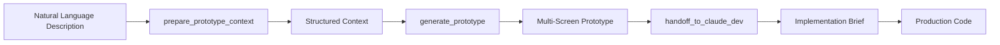

# v0-mcp

[English](README.md) | [中文](README_zh.md)

Vercel v0 MCP Server for Claude Code - Generate beautiful UI components using AI through the Model Context Protocol.

> ✨ **Collaborative Development**: This project was built through innovative collaboration between Claude Code and Gemini CLI using Vibe Coding methodology - demonstrating the power of AI-assisted development workflows.

## 🎯 Features

- **Generate UI Components**: Create React components from natural language descriptions
- **Image to UI**: Convert design images into working React code
- **Chat-based Iteration**: Iteratively refine components through conversation
- **Multiple Models**: Support for v0-1.5-md, v0-1.5-lg, and v0-1.0-md
- **TypeScript Support**: Full type safety with Zod schema validation
- **Streaming Support**: Real-time generation progress

## 🚀 Quick Start

```bash
# 1. Clone and enter the project
git clone <repository-url> && cd v0-mcp

# 2. Install dependencies
npm install

# 3. Create .env file and add your v0 API key
npm run setup
# Edit .env file with your V0_API_KEY

# 4. Build the project
npm run build

# 5. Add to Claude Code (ensure you are in the project root)
claude mcp add v0-mcp --env V0_API_KEY=$(grep V0_API_KEY .env | cut -d '=' -f2) -- node $(pwd)/dist/main.js

# 6. Start using it in Claude Code!
# Try: "Hey v0-mcp, create a login form with email and password fields"
```

## 🛠 Installation

### 1. Clone or Download
```bash
git clone <repository-url>
cd v0-mcp
```

### 2. Install Dependencies
```bash
npm install
```

### 3. Setup Environment
```bash
npm run setup
# Edit .env file with your v0 API key
```

### 4. Build Project
```bash
npm run build
```

## ⚙️ Configuration

### 🔑 Getting Your v0 API Key

Before configuring v0-mcp, you'll need a v0 API key:

1. **Visit the [v0 Model API documentation](https://vercel.com/docs/v0/model-api)**
2. **Sign in to your Vercel account**
3. **Navigate to the API Keys section**
4. **Generate a new API key**
5. **Copy and save your key securely**

### Claude Code Integration

📖 **Quick setup guide - choose the method that works best for you**

#### Method 1: CLI Configuration (Recommended)

1. **Add v0-mcp using the Claude Code CLI:**
   ```bash
   # Navigate to your v0-mcp directory first
   cd /path/to/your/v0-mcp
   
   # Add the MCP server using current directory
   claude mcp add v0-mcp -- node $(pwd)/dist/main.js
   ```

2. **Set your v0 API key:**

   **Option A: Add key during CLI setup**
   ```bash
   # When adding the server, include the API key (run from v0-mcp directory)
   claude mcp add v0-mcp --env V0_API_KEY=your_v0_api_key_here -- node $(pwd)/dist/main.js
   ```

   **Option B: Edit `.claude.json` file after setup**
   
   After running the `claude mcp add` command, edit the generated `.claude.json` file:
   ```json
   {
     "mcpServers": {
       "v0-mcp": {
         "type": "stdio",
         "command": "node",
         "args": ["/absolute/path/to/your/v0-mcp/dist/main.js"],
         "env": {
           "V0_API_KEY": "your_v0_api_key_here"
         }
       }
     }
   }
   ```
   
   **Option C: System environment variable (Most secure)**
   ```bash
   # Add to your shell profile (.bashrc, .zshrc, etc.)
   echo 'export V0_API_KEY="your_v0_api_key_here"' >> ~/.zshrc
   
   # Reload your shell configuration
   source ~/.zshrc
   ```

3. **Verify your setup:**
   ```bash
   claude mcp list
   node scripts/verify-claude-code-setup.js
   ```
   
   ✅ **Expected Output:**
   ```
   Verifying v0 API connection...
   ✓ v0-mcp server found in Claude configuration
   ✓ API key is configured
   ✓ Successfully connected to v0 API
   Setup is complete! You can now use v0-mcp in Claude Code.
   ```

#### Method 2: Manual Configuration (Advanced)

1. **Create or edit the Claude Code configuration file:**
   - **macOS/Linux**: `~/.claude.json`
   - **Windows**: `%USERPROFILE%\.claude.json`

2. **Add the v0-mcp server configuration:**

```json
{
  "mcpServers": {
    "v0-mcp": {
      "type": "stdio",
      "command": "node",
      "args": ["/absolute/path/to/v0-mcp/dist/main.js"],
      "env": {
        "V0_API_KEY": "your_v0_api_key_here"
      }
    }
  }
}
```

3. **Restart Claude Code** for the changes to take effect.

#### Verification

After configuration, you should see v0-mcp tools available in Claude Code:

**Core V0 Tools:**
- ✅ `v0_generate_ui` - Generate UI components from text
- ✅ `v0_generate_from_image` - Generate UI from image references
- ✅ `v0_chat_complete` - Iterative UI development chat
- ✅ `v0_setup_check` - Verify API connectivity

**Prototype Workflow Tools:**
- ✅ `prepare_prototype_context` - Parse product descriptions
- ✅ `generate_prototype` - Generate multi-screen prototypes
- ✅ `handoff_to_claude_dev` - Create implementation briefs

### 🔗 Why Use MCP (Model Context Protocol)?

**MCP Benefits:**
- **Seamless Integration**: Tools appear natively in Claude without API juggling
- **Enhanced Context**: Claude understands your v0 workflow and provides better assistance
- **Real-time Availability**: Tools are always accessible during your coding sessions
- **Type Safety**: Full parameter validation and error handling built-in
- **Persistent State**: Maintains conversation context across tool calls

**How It Works:**
When you mention v0-mcp or UI generation in Claude, the tools automatically become available. Claude can intelligently choose the right tool based on your request, making the development process feel natural and integrated.

### Claude Desktop Integration

Add to your `claude_desktop_config.json`:

```json
{
  "mcpServers": {
    "v0-mcp": {
      "command": "node",
      "args": ["/path/to/v0-mcp/dist/main.js"],
      "env": {
        "V0_API_KEY": "your_v0_api_key_here"
      }
    }
  }
}
```

### Cursor Integration

Add to your Cursor MCP configuration:

```json
{
  "mcpServers": {
    "v0-mcp": {
      "command": "node",
      "args": ["/path/to/v0-mcp/dist/main.js"],
      "env": {
        "V0_API_KEY": "your_v0_api_key_here"
      }
    }
  }
}
```

## 🔧 Available Tools

### Core V0 Tools

#### `v0_generate_ui`
Generate UI components from text descriptions.

**Parameters:**
- `prompt` (required): Description of the UI component
- `model`: v0 model to use (default: v0-1.5-md)
- `stream`: Enable streaming response (default: false)
- `context`: Optional existing code context

#### `v0_generate_from_image`
Generate UI components from image references.

**Parameters:**
- `imageUrl` (required): URL of the reference image
- `prompt`: Additional instructions
- `model`: v0 model to use (default: v0-1.5-md)

#### `v0_chat_complete`
Chat-based UI development with conversation context.

**Parameters:**
- `messages` (required): Array of conversation messages
- `model`: v0 model to use (default: v0-1.5-md)
- `stream`: Enable streaming response (default: false)

#### `v0_setup_check`
Validate v0 API configuration and connectivity.

### Prototype Workflow Tools

#### `prepare_prototype_context`
Parse natural language product descriptions into structured prototype requirements.

**Parameters:**
- `text` (required): Natural language description
- `images` (optional): Array of wireframe/design URLs

**Returns:**
- Product name, goal, platform, screens
- Layout hints from images (if provided)
- Validation status and suggestions

#### `generate_prototype`
Generate multi-screen UI prototype with automatic "no backend" constraints.

**Parameters:**
- `prototype_context` (required): From prepare_prototype_context
- `design_style` (optional): Design preferences
- `ui_reference` (optional): Reference URLs
- `model` (optional): V0 model (default: v0-1.5-md)
- `stream` (optional): Enable streaming

**Returns:**
- Prototype ID
- Generated screens and components
- Preview URL
- Status (success/partial_success/failed)

#### `handoff_to_claude_dev`
Convert V0 prototype into implementation brief for Claude dev agent.

**Parameters:**
- `prototype_id` (required): From generate_prototype
- `prototype_result` (required): Full generate_prototype result
- `prototype_context` (required): From prepare_prototype_context

**Returns:**
- Product summary
- Screen descriptions
- Component lists
- UX patterns (navigation, flows, interactions)
- Implementation rules and boundaries

## 🎨 Prototype Workflow (3-Command System)

The v0-mcp server includes a powerful 3-command workflow for rapidly prototyping multi-screen applications. This workflow separates UI design (V0's strength) from implementation logic (Claude's strength), enabling efficient product development.

### Workflow Overview



### Step 1: `prepare_prototype_context`

Parse natural language product descriptions into structured prototype requirements.

**Parameters:**
- `text` (required): Natural language description of your product
- `images` (optional): Array of wireframe/design image URLs

**What it does:**
- Extracts product name, goal, and screens from your description
- Infers platform (web/mobile) from context
- Analyzes wireframe images for layout hints (if provided)
- Validates the extracted context

**Example Usage:**
```
Use prepare_prototype_context to parse this product idea:
"Building a task management system called TaskMaster. Users need a dashboard to view all tasks, a task list page with filters, and a settings page for preferences. This is for web."
```

**Example Output:**
```
✅ Prototype Context Prepared

**Product Name**: task management
**Platform**: web
**Goal**: Task management system for organizing and tracking tasks
**Screens** (3):
  - dashboard
  - task list
  - settings

**Confidence**: high

Ready for generate_prototype! Use this context to generate your multi-screen prototype.
```

### Step 2: `generate_prototype`

Generate a multi-screen UI prototype using V0, with automatic "no backend" constraints.

**Parameters:**
- `prototype_context` (required): Output from prepare_prototype_context
- `design_style` (optional): Design preferences (e.g., "modern", "minimal", "colorful")
- `ui_reference` (optional): Reference URLs for design inspiration
- `model` (optional): V0 model to use (default: v0-1.5-md)
- `stream` (optional): Enable streaming (default: false)

**What it does:**
- Calls V0 API with all screens from your context
- Enforces "UI only, no backend" constraints automatically
- Implements retry logic for failed generations
- Returns partial results if not all screens can be generated

**Example Usage:**
```
Use generate_prototype with the context from Step 1 and design_style: "modern, clean interface with light color scheme"
```

**Example Output:**
```
✅ Prototype Generated Successfully

**Prototype ID**: proto_1234567890
**Platform**: web
**Screens Generated**: 3/3

**Generated Screens**:
  - dashboard
  - task-list
  - settings

**Components** (8):
  task-card, filter-bar, settings-form, header, sidebar, footer, task-status-badge, priority-indicator

**Preview**: https://v0.dev/t/abc123
**Model**: v0-1.5-md
**Duration**: 12.34s

Next: Use handoff_to_claude_dev to convert this prototype into an implementation brief for development.
```

### Step 3: `handoff_to_claude_dev`

Convert the V0 prototype into a structured implementation brief for Claude dev agent.

**Parameters:**
- `prototype_id` (required): ID from generate_prototype
- `prototype_result` (required): Full result from generate_prototype
- `prototype_context` (required): Original context from prepare_prototype_context

**What it does:**
- Extracts UX patterns (navigation, flows, interactions)
- Defines clear implementation boundaries (preserve UI, implement backend)
- Provides platform-specific implementation guidance
- Creates actionable rules for Claude dev agents

**Example Usage:**
```
Use handoff_to_claude_dev with the prototype_id, prototype_result, and prototype_context from Steps 1 and 2
```

**Example Output:**
```
# TaskMaster - Implementation Brief
**Product Goal**: Task management system for organizing and tracking tasks
**Platform**: web
**Prototype Status**: Complete
**Screens**: 3/3 generated

## Overview
This is an implementation brief for TaskMaster, a web application.
The UI prototype has been generated with V0 and contains 3 screens.
Your task is to implement the backend logic, data handling, and business rules while preserving the prototyped UI layout.

## Screens

**dashboard**
  Main web dashboard screen. Shows key metrics, navigation, and primary actions.

**task-list**
  List/directory screen for browsing and managing multiple items.
  **Components**: task-card, filter-bar

**settings**
  User settings/preferences screen. Provides customization options.
  **Components**: settings-form

## UX Patterns

### Navigation Patterns
- Primary navigation centered around dashboard/home screen
- Web navigation (sidebar, top navigation bar, breadcrumbs)

### Screen Flows
- Dashboard → Settings/Profile → Save → Dashboard (settings flow)

### Interaction Patterns
- Mouse/keyboard interactions (click, hover states, keyboard shortcuts)
- Loading states for async operations
- Error states with recovery actions

## Implementation Rules

**PRESERVE VISUAL LAYOUT**: Use the V0-generated components as-is. Do not redesign unless absolutely necessary.
**IMPLEMENT BACKEND LOGIC**: Add API integration, data fetching, state management, and business rules.
**ADD VALIDATION**: Implement form validation, input sanitization, and error handling.
**IMPLEMENT AUTH**: Add authentication, authorization, and session management if applicable.
**ADD TESTING**: Add unit tests for business logic, integration tests for API calls, and E2E tests for critical flows.

[... Full implementation rules ...]

**Preview Reference**: https://v0.dev/t/abc123
```

### Complete Workflow Example

Here's a complete end-to-end example:

```markdown
**User:** I want to build a booking app called "ReserveIt" for restaurant reservations.
Users need to see a calendar of available times, a reservations list, and an admin
dashboard to manage bookings. This is for web.

**Claude (Step 1):** Let me prepare the prototype context...

[Calls prepare_prototype_context]

✅ Context prepared with 3 screens: calendar, reservations-list, admin-dashboard

**Claude (Step 2):** Now I'll generate the multi-screen prototype...

[Calls generate_prototype with modern design style]

✅ Generated prototype with ID proto_1234567890
Preview: https://v0.dev/t/xyz789

**Claude (Step 3):** Let me create an implementation brief for development...

[Calls handoff_to_claude_dev]

✅ Implementation brief created with:
- 3 screen descriptions
- 12 identified components
- UX patterns (calendar interaction, list filtering, admin controls)
- Implementation rules for backend, auth, validation

**Next Steps:** Now you can ask Claude dev agent to implement the backend
using this brief while preserving the V0-generated UI.
```

### Troubleshooting Guide

#### Common Issues and Solutions

**Issue: "Product name not found"**
- **Cause:** Description too vague or doesn't mention product name
- **Solution:** Be more explicit, e.g., "Building a product called [Name]" or "Create [Name] app"

**Issue: "Weak input - low confidence"**
- **Cause:** Missing key information (screens, purpose, platform)
- **Solution:** Add more details about:
  - What screens you need
  - What the product does
  - Whether it's web or mobile

**Issue: "Partial success - only 2 of 5 screens generated"**
- **Cause:** V0 API limitations or complex screen requirements
- **Solution:**
  - Acceptable to proceed with partial results
  - Regenerate missing screens separately
  - Simplify screen descriptions

**Issue: "Platform inference defaulted to web"**
- **Cause:** No clear mobile/web indicators in description
- **Solution:** Explicitly mention "mobile app" or "web application"

#### Tips for Better Results

1. **Be Specific About Screens**
   - ✅ "needs a dashboard, user profile, and settings page"
   - ❌ "needs some pages for users"

2. **Include Product Context**
   - ✅ "task management system for teams"
   - ❌ "an app"

3. **Specify Platform When Needed**
   - ✅ "mobile app for iOS/Android"
   - ✅ "web dashboard for desktop"

4. **Use Wireframes for Complex Layouts**
   - Provide wireframe URLs in the `images` parameter
   - Tool will extract layout structure and components

5. **Design Style Matters**
   - Provide design_style in Step 2 for consistent aesthetics
   - Examples: "modern minimal", "vibrant colorful", "professional corporate"

### Core Principles

The prototype workflow follows a clear separation of concerns:

- **V0 Answers**: "What should the UI look like?"
  - Screen layouts
  - Component structure
  - Visual design
  - User interface patterns

- **Claude Dev Answers**: "How should the system work?"
  - Backend logic
  - API integration
  - Data management
  - Authentication
  - Business rules
  - Testing

This separation ensures:
- Faster prototype iterations (V0 is optimized for UI)
- Better code quality (Claude focuses on logic, not design)
- Clear handoff between design and development phases

## 🔑 Environment Variables

| Variable | Required | Default | Description |
|----------|----------|---------|-------------|
| `V0_API_KEY` | ✅ | - | Your v0 API key |
| `V0_BASE_URL` | ❌ | `https://api.v0.dev/v1` | v0 API base URL |
| `V0_DEFAULT_MODEL` | ❌ | `v0-1.5-md` | Default model to use |
| `V0_TIMEOUT` | ❌ | `60000` | API timeout (ms) |
| `MCP_SERVER_NAME` | ❌ | `v0-mcp` | MCP server name |
| `LOG_LEVEL` | ❌ | `info` | Logging level |

## 🚀 Usage Examples

### In Claude Code

Once configured, you can use v0-mcp in multiple ways:

#### Direct v0-mcp Usage
Simply mention v0-mcp in your request, and Claude will automatically select the appropriate tool:
```
Hey v0-mcp, create a modern login form with email and password fields
```

```
v0-mcp: Generate a dashboard component with charts and KPI cards
```

```
@v0-mcp convert this wireframe to a React component: [image URL]
```

#### Specific Tool Usage

##### Generate a Login Form
```
Use v0_generate_ui to create a modern login form with email, password fields, and a blue submit button with rounded corners.
```

##### Convert Design to Code  
```
Use v0_generate_from_image with this Figma design URL: https://example.com/design.png
```

##### Iterative Development
```
Use v0_chat_complete to refine the previous login form by adding a "Remember me" checkbox and "Forgot password" link.
```

##### Check API Setup
```
Use v0_setup_check to verify your v0 API connection and configuration.
```

### Advanced Usage Examples

#### Creating a Dashboard Component
```
Use v0_generate_ui with the following prompt:
"Create a modern dashboard component with a sidebar navigation, header with user profile dropdown, and a main content area with grid layout for cards. Include metrics cards showing KPIs with charts. Use shadcn/ui components and Tailwind CSS."
```

#### Building from a Wireframe
```
Use v0_generate_from_image with your wireframe image URL and add:
"Convert this wireframe into a fully functional React component. Add proper spacing, modern styling, and make it responsive for mobile devices."
```

#### Iterative Refinement
```
Use v0_chat_complete with conversation history:
[
  {"role": "user", "content": "Create a pricing table component"},
  {"role": "assistant", "content": "[Previous pricing table code]"},
  {"role": "user", "content": "Add a popular plan highlight and annual/monthly toggle"}
]
```

## 🧪 Development

```bash
# Development mode with hot reload
npm run dev

# Type checking
npm run lint

# Run tests
npm test

# Test with coverage
npm run test:coverage

# Test in CI mode
npm run test:ci

# Clean build artifacts
npm run clean

# Test configuration
npm run test:config

# Test basic functionality
npm run test:basic

# Verify Claude Code setup
npm run verify:claude-code
```

## 🛡️ Enhanced Features

### Structured Logging
- **Winston-based logging** with JSON format
- **Contextual information** for API calls and tool usage
- **Error tracking** with stack traces and metadata
- **Configurable log levels** via `LOG_LEVEL` environment variable

### Advanced Error Handling
- **Categorized error types** (API, Network, Timeout, Rate Limit, etc.)
- **Retry logic** with exponential backoff for transient errors
- **User-friendly error messages** with actionable guidance
- **Comprehensive error metadata** for debugging

### Testing Infrastructure
- **Jest testing framework** with TypeScript support
- **Comprehensive unit tests** for all core components
- **Test coverage reporting** with configurable thresholds
- **Mock implementations** for external dependencies

### Improved Reliability
- **Input validation** using Zod schemas
- **Graceful error handling** for all failure modes
- **Performance monitoring** with request timing
- **Health checks** for API connectivity

## 💖 Support This Project

If you find this project helpful, please consider supporting it:

[](https://coff.ee/hellolucky)

Your support helps maintain and improve v0-mcp!

## 📄 License

MIT